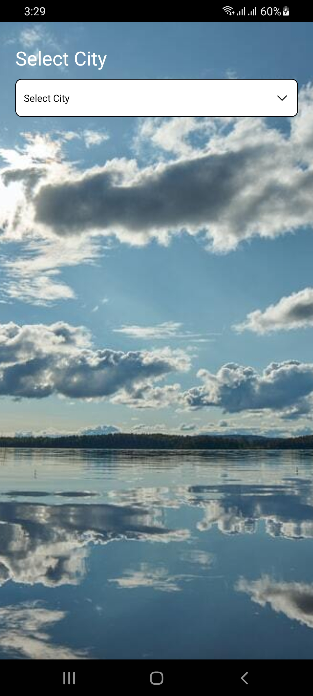
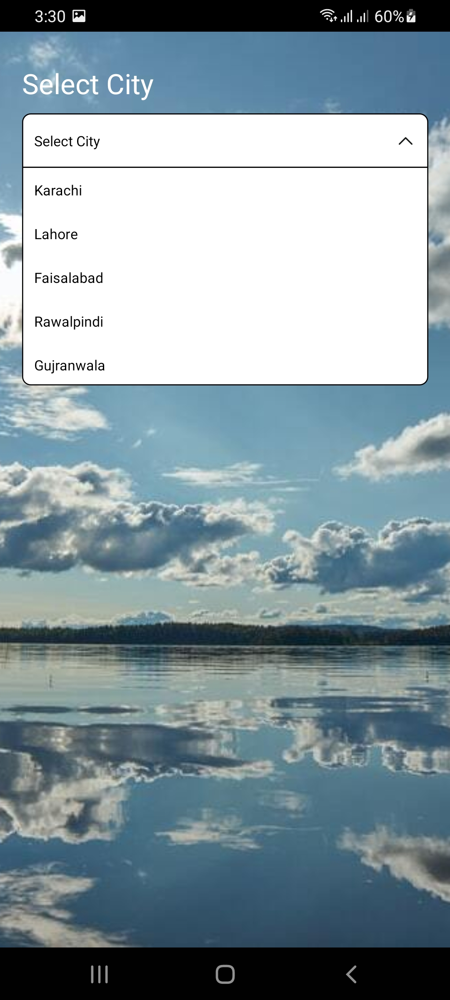
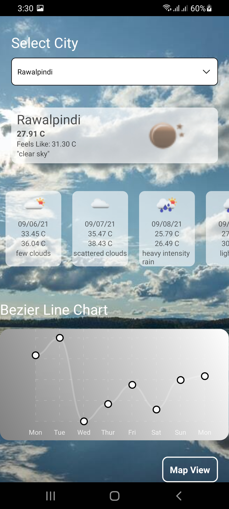
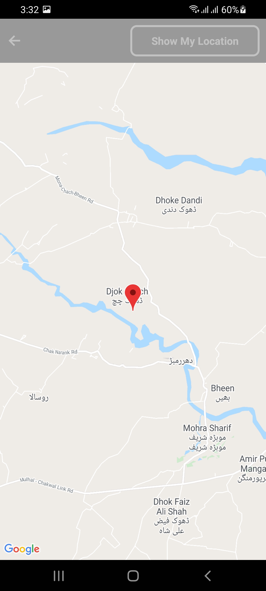

## About The Project

This App is built using React Native. It shows the weather report of selected city.
Open Weather API is used for getting weather data
It also shows the Map View of selected city location as well as user current location

## App UI ScreenShots

<p align="center">

<a>
    
    
    
    

</a>
</p>

### Installation

1. Clone the repo
   ```sh
   git clone https://github.com/AsadBaig039/WeatherApp.git
   ```
2. Install NPM packages

   ```sh
   npm install
   ```

### Run Application

4. Open Project Root Directory in VSCode Terminal

5. Run the Command
   ```sh
   react-native run-android
   ```

## Contact

ASAD BAIG - [asad.baig039@gmail.com](asad.baig039@gmail.com)

Project Link: [https://github.com/AsadBaig039/WeatherApp.git](https://github.com/AsadBaig039/WeatherApp.git)
